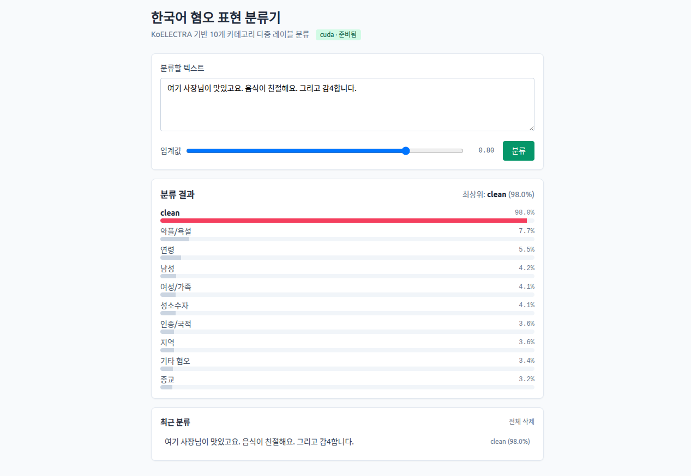

# Korean UnSmile Multi-label Classification

KoELECTRA 기반 한국어 혐오 표현 **다중 레이블 분류** 시스템.
**학습 파이프라인(CLI) + 추론 API(FastAPI) + 웹 UI(Vue 3)** 으로 구성된 풀스택 프로젝트입니다.

[](https://python.org)
[](https://pytorch.org)
[](https://huggingface.co/transformers)
[](https://fastapi.tiangolo.com/)
[](https://vuejs.org/)
[](LICENSE)

---

## 개요

[Korean UnSmile 데이터셋](https://huggingface.co/datasets/smilegate-ai/kor_unsmile) (smilegate-ai) 을 사용해 한국어 텍스트를 10 개 카테고리로 동시에 분류합니다. 한 문장이 **여러 카테고리에 동시 속할 수 있는** 다중 레이블 문제이므로 sigmoid + 카테고리별 threshold 기반으로 동작합니다.

### 분류 카테고리 (10개)

| 카테고리 | 설명 |
|---|---|
| 여성/가족 | 여성성/여성 성역할 통념, 여성 차별 희화화, 페미니즘 관련 악플 |
| 남성 | 집단으로서의 남성 일반을 비하·조롱·희화화 |
| 성소수자 | 성소수자를 배척하거나 희화화하는 표현 |
| 인종/국적 | 특정 인종·국적에 대한 욕설, 고정관념, 조롱 |
| 연령 | 특정 세대·연령을 비하하는 은어 및 혐오 표현 |
| 지역 | 특정 지역에 대한 은어·혐오 표현 |
| 종교 | 특정 종교 혐오 및 종교인 집단 비난 |
| 기타 혐오 | 위 카테고리 외 집단 대상 혐오 표현 |
| 악플/욕설 | 집단 지칭 없는 비하/욕설, 불쾌감을 주는 내용 |
| clean | 혐오·욕설·불쾌감·음란성 내용이 없는 일반 문장 |

### 주요 특징

- KoELECTRA-base-v3-discriminator 인코더 위에 다중 레이블 분류 헤드 부착
- BCEWithLogits / Weighted BCE / Focal Loss 선택 가능 (클래스 불균형 대응)
- 학습/평가/추론이 의존성 분리 — 서빙단은 `requirements-api.txt` 만으로 구동
- FastAPI + Vue 3 SPA 로 즉시 동작하는 MVP UI 제공
- 5 종 학습 프리셋(default / debug / large_batch / high_lr / conservative)
- 임계값 민감도 분석, 어려운 샘플 추출, 혼동 행렬 시각화 등 평가 리포트 자동 생성

---

## 데모



> 텍스트 입력 → 임계값 조정 → 10 개 카테고리 확률 표시. 최근 분류 10건은 브라우저 localStorage 에 저장됩니다.

---

## 빠른 시작

### 1. 학습용 환경 설정

```bash
python -m venv venv
source venv/bin/activate              # Linux/Mac (Windows: venv\Scripts\activate)

# 학습/평가용 풀 의존성
pip install -r backend/requirements.txt
```

### 2. 학습 파이프라인 (CLI)

```bash
# 데이터 다운로드 + 전처리 + 학습 + 평가까지 한 번에
python backend/main.py pipeline
```

산출물은 `backend/output/<run_name>/` 하위에 저장됩니다 (체크포인트, 메트릭, 시각화, 평가 리포트).

### 3. API 서버 + Frontend (MVP)

```bash
# Terminal 1 — FastAPI 서버 (프로젝트 루트에서)
pip install -r backend/requirements-api.txt   # 추론만 한다면 경량 의존성으로 충분
uvicorn backend.api.app:app --reload --port 8000

# Terminal 2 — Vue 개발 서버 (frontend/ 디렉토리에서)
cd frontend
npm install        # 최초 1회
npm run dev        # http://localhost:5173 (Vite proxy: /api → :8000)
```

> Node 18 LTS 이상 필요. 사전 학습된 체크포인트 경로는 `MODEL_CHECKPOINT_PATH` 환경변수로 override 가능합니다.

---

## CLI 사용법

### 개별 단계 실행

```bash
# 1) 데이터 다운로드 + 전처리만
python backend/main.py process-data

# 2) 모델 훈련만
python backend/main.py train

# 3) 모델 평가만
python backend/main.py evaluate \
    --model_path backend/output/<run_name>/checkpoints/best_model.pth \
    --eval_data backend/korean_unsmile_csv/korean_unsmile_valid.csv
```

### 자주 쓰는 옵션

```bash
# GPU 메모리가 부족한 경우
python backend/main.py train --batch_size 4 --max_length 256

# 빠른 테스트 (작은 데이터, 1 epoch)
python backend/main.py train --preset debug

# 커스텀 설정
python backend/main.py train \
    --batch_size 8 \
    --learning_rate 1e-5 \
    --num_epochs 3 \
    --dropout_rate 0.2
```

### 설정 파일 기반 학습

```bash
# 설정 파일 생성 → 수정 후 재사용
python backend/main.py create-config --preset conservative --output_file my_config.json
python backend/main.py train --config my_config.json
```

전체 옵션은 `python backend/main.py <command> --help` 로 확인할 수 있습니다.

---

## API

`uvicorn backend.api.app:app` 가 떠 있는 동안 사용 가능한 엔드포인트.

| Method | Path | 설명 |
|---|---|---|
| GET | `/api/health` | 모델 로드 상태, device (`cpu` / `cuda`) |
| GET | `/api/labels` | 10 개 라벨 메타 (이름 + 설명) |
| POST | `/api/predict` | `{ text, threshold }` → 라벨별 확률 + top 라벨 |

### 호출 예시

```bash
curl -X POST http://127.0.0.1:8000/api/predict \
  -H "Content-Type: application/json" \
  -d '{"text":"이 바보야!", "threshold":0.5}'
```

응답:

```json
{
  "text": "이 바보야!",
  "threshold": 0.5,
  "labels": [
    {"name": "악플/욕설", "probability": 0.98, "predicted": true},
    {"name": "clean",     "probability": 0.02, "predicted": false},
    ...
  ],
  "top": {"name": "악플/욕설", "probability": 0.98, "predicted": true}
}
```

### Python 직접 호출

서버 없이 추론 엔진을 직접 사용하려면:

```python
from backend.api.inference import InferenceEngine

engine = InferenceEngine()
engine.load()
result = engine.predict("이 바보야!", threshold=0.5)
print(result["top"])
```

---

## 프로젝트 구조

```
text_multi_classification/
├── README.md
├── LICENSE
├── docs/                                # 아키텍처 / UML 문서
│   ├── architecture.md
│   └── uml.md
├── backend/                             # 학습/평가/추론
│   ├── main.py                          # CLI 엔트리포인트
│   ├── config.py                        # ExperimentConfig + ConfigManager (5 프리셋)
│   ├── data_processor.py                # HF dataset → CSV + label_info.json
│   ├── model.py                         # MultiLabelElectraClassifier + Loss
│   ├── trainer.py                       # 학습 루프
│   ├── evaluator.py                     # 평가/시각화/리포트
│   ├── utils.py                         # Metrics / EarlyStopping / Viz
│   ├── requirements.txt                 # 학습/평가 풀 의존성
│   ├── requirements-api.txt             # API 경량 의존성
│   ├── api/                             # FastAPI 추론 서비스
│   │   ├── app.py                       # 라우터 + lifespan + CORS
│   │   ├── inference.py                 # InferenceEngine (싱글톤)
│   │   └── schemas.py                   # Pydantic I/O
│   ├── korean_unsmile_csv/              # 처리된 CSV + 메타데이터
│   └── output/<run_name>/               # 학습 산출물 (.gitignore)
│       ├── checkpoints/best_model.pth
│       ├── plots/
│       ├── experiment_config.json
│       └── final_metrics.json
└── frontend/                            # Vue 3 + Vite + TS + Tailwind v3.4
    ├── index.html, package.json, vite.config.ts, tsconfig.json
    └── src/
        ├── main.ts, App.vue, styles.css
        └── lib/
            ├── api.ts                   # fetch 래퍼
            └── storage.ts               # localStorage 히스토리
```

자세한 모듈 책임과 데이터 흐름은 [`docs/architecture.md`](./docs/architecture.md), 클래스/시퀀스 다이어그램은 [`docs/uml.md`](./docs/uml.md) 를 참조하세요.

---

## 설정 옵션

### 주요 하이퍼파라미터

| 파라미터 | 기본값 | 설명 | 권장 범위 |
|---|---|---|---|
| `batch_size` | 16 | 배치 크기 | 4 – 32 |
| `learning_rate` | 2e-5 | 학습률 | 1e-5 – 5e-5 |
| `num_epochs` | 5 | 훈련 에포크 | 3 – 10 |
| `max_length` | 512 | 최대 시퀀스 길이 | 128 – 512 |
| `dropout_rate` | 0.1 | 드롭아웃 비율 | 0.1 – 0.3 |
| `loss_type` | `weighted_bce` | 손실 함수 | `bce` / `weighted_bce` / `focal` |
| `gradient_accumulation_steps` | 1 | 그라디언트 누적 | ≥ 1 |

### 사전 정의 프리셋

| 프리셋 | 용도 |
|---|---|
| `default` | 균형잡힌 일반 학습 |
| `debug` | 작은 데이터, 1 epoch — 동작 확인용 |
| `conservative` | 낮은 LR, 높은 dropout, 긴 patience |
| `large_batch` | 큰 배치 + grad accumulation |
| `high_lr` | 빠른 수렴용 높은 LR + warmup |

---

## 성능 (참고치)

KoELECTRA-base, validation 셋 기준 일반적인 학습 결과:

| 메트릭 | 점수 |
|---|---|
| Exact Match Accuracy | ~ 0.75 |
| Macro F1 | ~ 0.80 |
| Macro Precision | ~ 0.82 |
| Macro Recall | ~ 0.78 |
| Hamming Loss | ~ 0.15 |

### 훈련 시간 (참고)

| 환경 | 시간 |
|---|---|
| RTX 4090 | ~ 1.5 시간 |
| RTX 3080 | ~ 2 – 3 시간 |
| RTX 4060 Laptop | ~ 4 – 5 시간 |
| Google Colab (T4) | ~ 3 – 4 시간 |

---

## 산출물

학습 / 평가가 끝나면 `backend/output/<run_name>/` 에 다음이 생성됩니다.

```
output/<run_name>/
├── checkpoints/
│   ├── best_model.pth                   # 추론 서버가 로드하는 파일
│   └── checkpoint_step_*.pth
├── plots/
│   ├── training_history.png
│   ├── label_distribution.png
│   ├── per_label_metrics.png
│   └── confusion_matrices.png
├── logs/training.log
├── experiment_config.json               # 재현용 설정
├── training_history.json
├── best_metrics.json
├── final_metrics.json
└── evaluation/                          # pipeline 모드일 때
    ├── evaluation_report.json
    ├── classification_report.txt
    ├── detailed_predictions.csv
    └── plots/
```

---

## 문제 해결

### GPU 메모리 부족

```bash
# 배치 크기 / 시퀀스 길이 줄이기
python backend/main.py train --batch_size 4 --max_length 256

# 또는 PyTorch 메모리 단편화 회피
export PYTORCH_CUDA_ALLOC_CONF=expandable_segments:True
python backend/main.py train --batch_size 4
```

### 자주 발생하는 오류

| 오류 | 해결책 |
|---|---|
| `CUDA out of memory` | `--batch_size 4 --max_length 256` |
| `ModuleNotFoundError` | `pip install -r backend/requirements.txt` |
| 체크포인트 로드 실패 | PyTorch 2.6+ `weights_only=False` 처리됨 — 다른 버전 확인 |
| 데이터셋 다운로드 실패 | 인터넷 연결 / `~/.cache/huggingface` 권한 확인 |
| API 가 모델을 못 찾음 | `MODEL_CHECKPOINT_PATH` 환경변수로 체크포인트 절대경로 지정 |

---

## 문서

| 문서 | 내용 |
|---|---|
| [`docs/architecture.md`](./docs/architecture.md) | 레이어 구조, 모듈 책임, 데이터 흐름, 배포 토폴로지, 설계 결정 |
| [`docs/uml.md`](./docs/uml.md) | 컴포넌트 / 클래스 / 시퀀스 / 상태 / 활동 / ER / 패키지 다이어그램 (Mermaid) |

---

## 라이선스

[MIT](./LICENSE)

Korean UnSmile 데이터셋은 [smilegate-ai/kor_unsmile](https://huggingface.co/datasets/smilegate-ai/kor_unsmile) 의 라이선스를 따릅니다.
