# UML 다이어그램

본 문서는 **Korean UnSmile Multi-label Classification** 프로젝트의 정적·동적 구조를 Mermaid 기반 UML 로 표현한다. GitHub / GitLab / VS Code Markdown Preview 등에서 그대로 렌더링된다.

---

## 1. 컴포넌트 다이어그램 (Component Diagram)

시스템 전체 컴포넌트의 의존 관계.

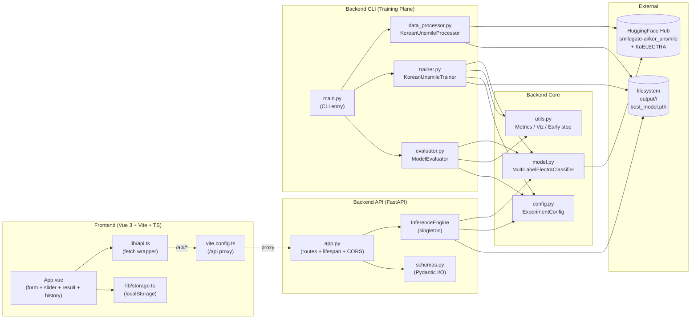

---

## 2. 클래스 다이어그램 — Backend Core (Model & Config)

KoELECTRA 모델·데이터셋·손실 함수·실험 설정.

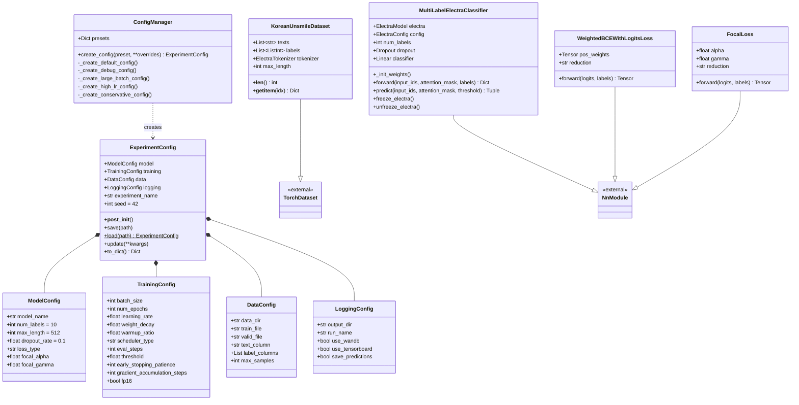

---

## 3. 클래스 다이어그램 — Training & Evaluation Pipeline

데이터 처리·학습 루프·평가·유틸리티.

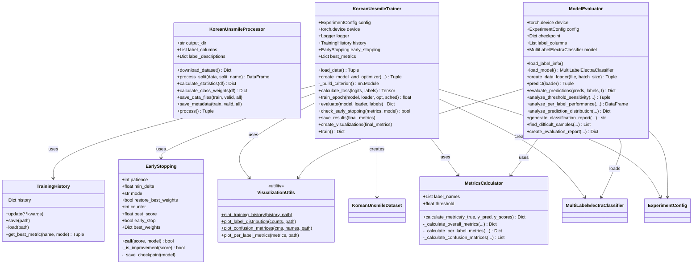

---

## 4. 클래스 다이어그램 — API (Serving Plane)

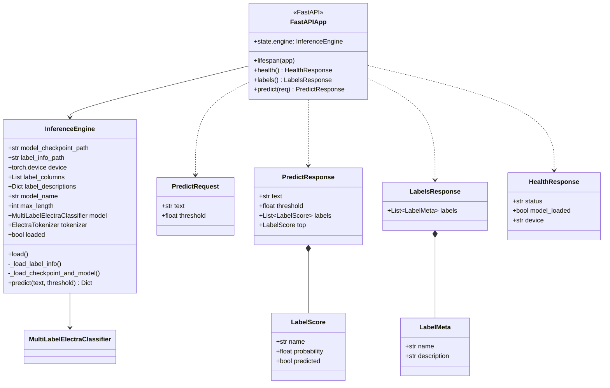

---

## 5. 클래스 다이어그램 — Frontend

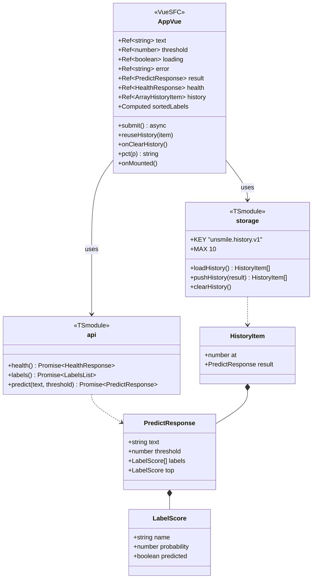

---

## 6. 시퀀스 다이어그램 — 학습 파이프라인

`python backend/main.py pipeline` 실행 시 호출 흐름.

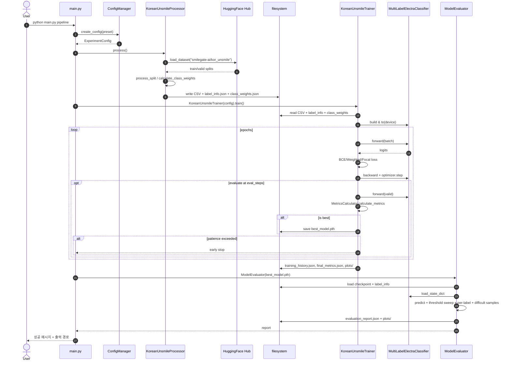

---

## 7. 시퀀스 다이어그램 — 추론 요청

브라우저에서 분류 버튼을 누른 순간부터 결과 표시까지.

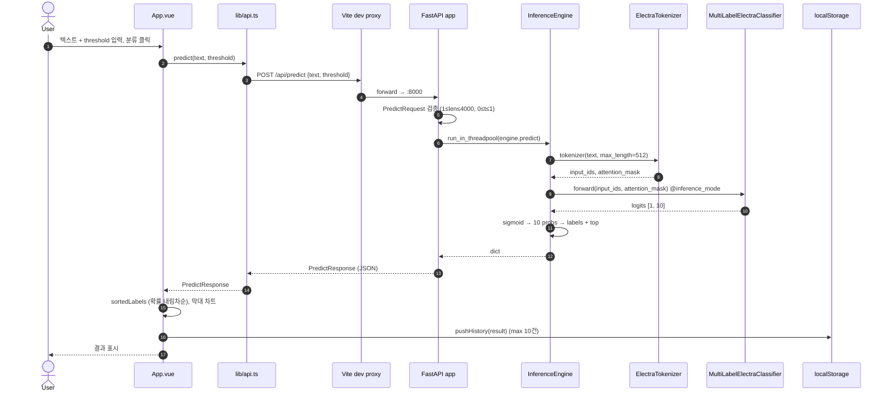

---

## 8. 시퀀스 다이어그램 — 서버 부팅 (lifespan)

FastAPI 가 뜨면서 모델을 1회 로드하는 과정.

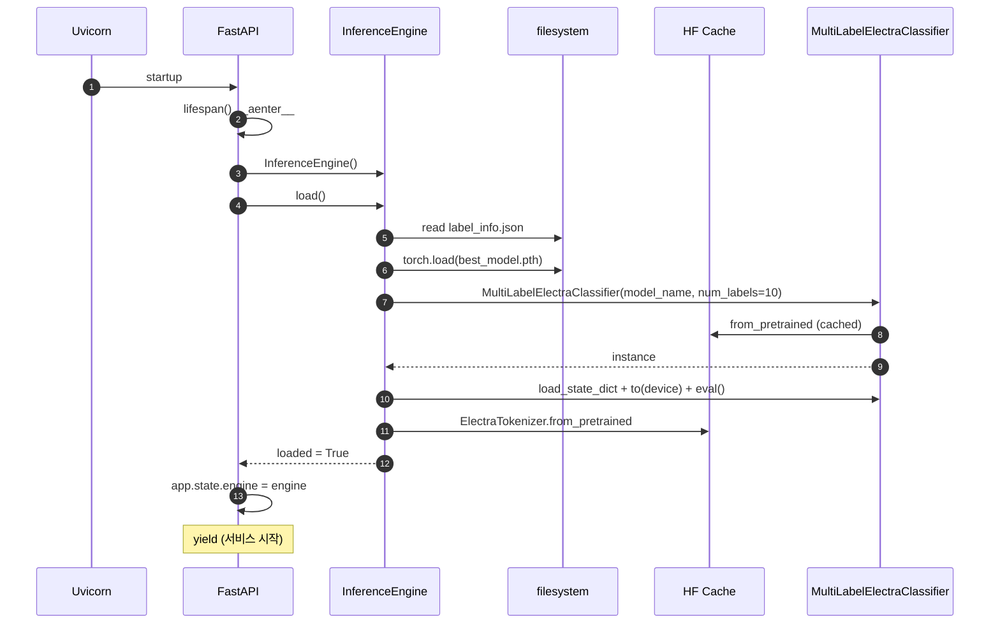

---

## 9. 상태 다이어그램 — Early Stopping

`utils.py:EarlyStopping` 의 상태 전이.

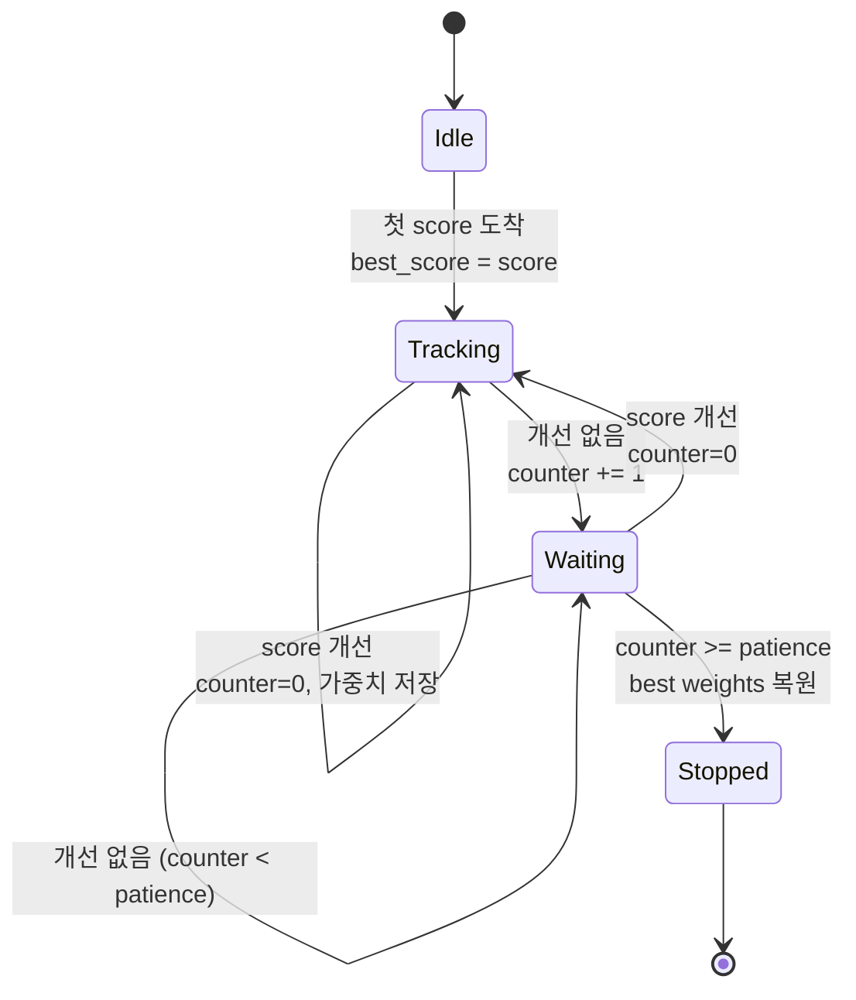

---

## 10. 활동 다이어그램 — 학습 한 에포크 (Gradient Accumulation 포함)

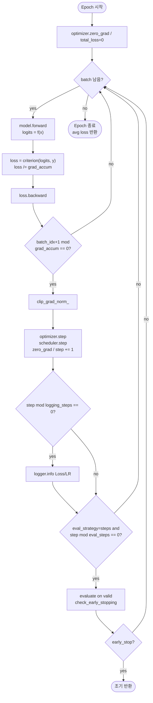

---

## 11. ER 다이어그램 (간이) — 산출물 파일 관계

학습/평가가 생성하는 파일 간의 의미 관계.

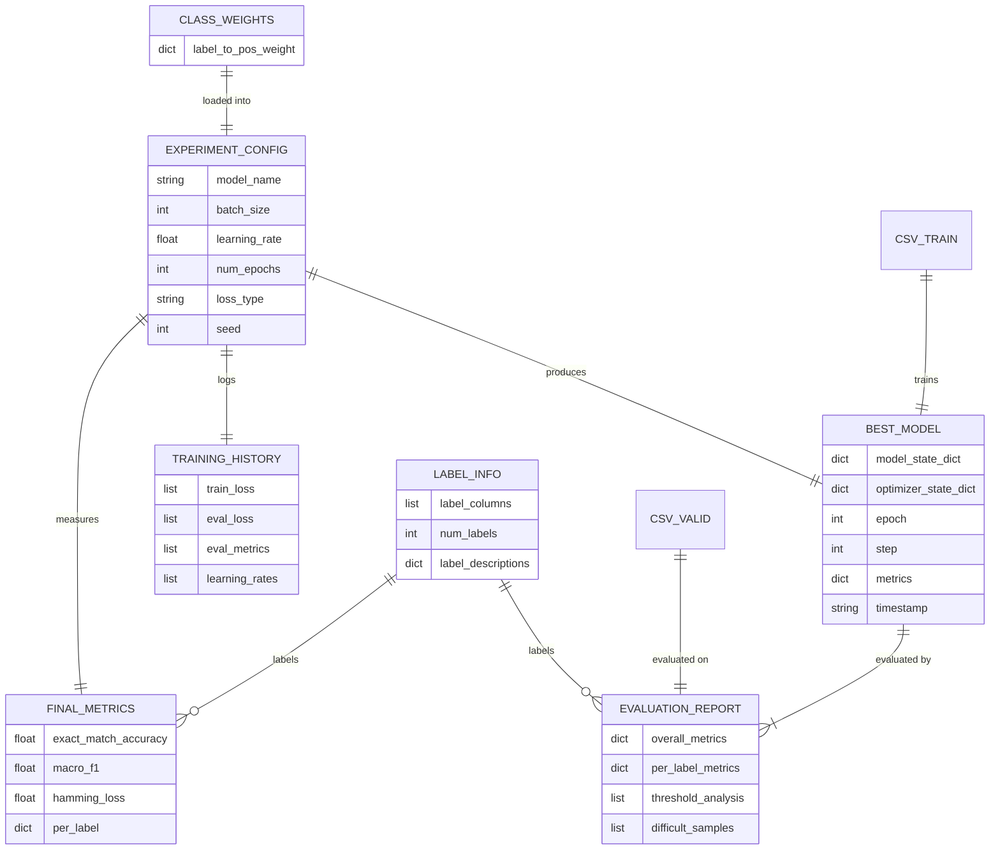

---

## 12. 패키지 다이어그램

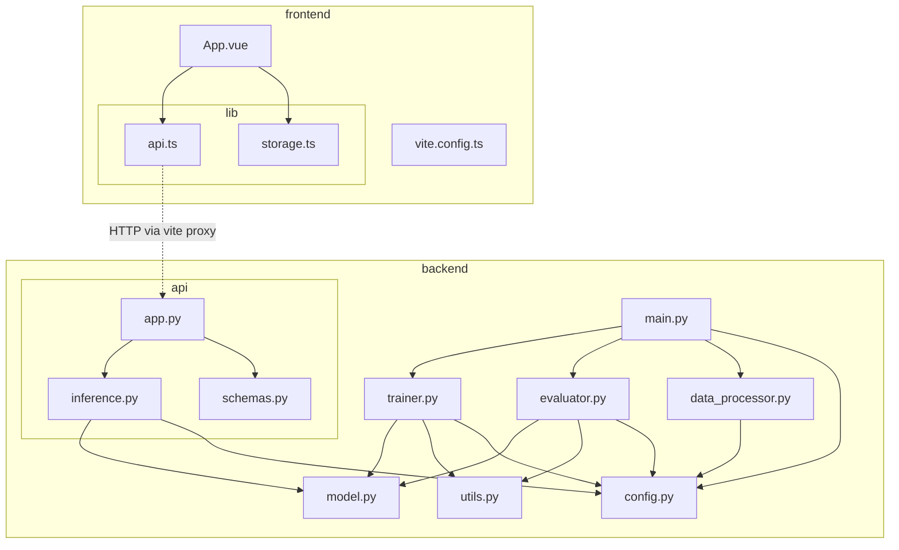

---

## 13. 다이어그램 인덱스

| # | 다이어그램 | 범위 |
|---|---|---|
| 1 | 컴포넌트 다이어그램 | 전체 시스템 |
| 2 | 클래스 다이어그램 | Model & Config |
| 3 | 클래스 다이어그램 | Training & Eval |
| 4 | 클래스 다이어그램 | API (Serving) |
| 5 | 클래스 다이어그램 | Frontend |
| 6 | 시퀀스 다이어그램 | 학습 파이프라인 |
| 7 | 시퀀스 다이어그램 | 추론 요청 |
| 8 | 시퀀스 다이어그램 | 서버 부팅 |
| 9 | 상태 다이어그램 | Early Stopping |
| 10 | 활동 다이어그램 | 학습 1 에포크 |
| 11 | ER 다이어그램 | 산출물 파일 |
| 12 | 패키지 다이어그램 | 모듈 의존 관계 |
